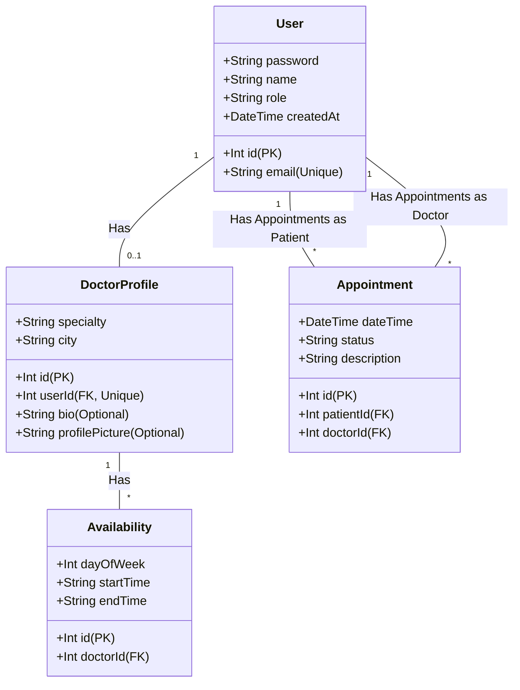

# 🏥 System Rezerwacji Medycznej - Dokumentacja API (v2.0)

Kompletny, profesjonalny i bezpieczny backend dla Systemu Rezerwacji Medycznej. Zbudowany na bazie **Node.js**, **Express.js**, **Prisma ORM** oraz lokalnej bazy danych **SQLite**.

API wspiera pełne uwierzytelnianie użytkowników, dynamiczne generowanie slotów godzinowych dla lekarzy, role użytkowników (RBAC) oraz zarządzanie wizytami medycznymi wraz ze szczegółowym opisem celu każdej wizyty.

---

## 🚀 Szybki Start

### 1. Klonowanie i instalacja zależności
Przejdź do folderu `backend` i zainstaluj potrzebne pakiety:
```bash
cd backend
npm install
```

### 2. Konfiguracja bazy danych (Prisma)
Zsynchronizuj schemat Prisma z lokalną bazą SQLite oraz wygeneruj klienta Prisma:
```bash
npx prisma db push
npx prisma generate
```

### 3. Zmienne środowiskowe (`.env`)
W katalogu głównym projektu `backend` znajduje się plik `.env` zawierający podstawową konfigurację:
```env
PORT=5000
DATABASE_URL="file:./prisma/dev.db"
JWT_SECRET="supersecret"
```

### 4. Uruchomienie aplikacji
Aby uruchomić serwer w trybie deweloperskim (z automatycznym restartem przez nodemon):
```bash
npm run dev
```
Domyślnie serwer nasłuchuje na porcie `5000` pod adresem: `http://localhost:5000`.

---

## 👥 Role i Uprawnienia

Aplikacja oparta jest na systemie ról (Role-Based Access Control - RBAC). Dostępne są trzy role użytkowników:
1. **`PATIENT`** (Klient/Pacjent) – może rejestrować się, przeglądać lekarzy i ich wolne sloty, rezerwować wizyty (podając cel wizyty) oraz przeglądać swoje rezerwacje.
2. **`DOCTOR`** (Lekarz) – posiada profil medyczny (specjalizacja, miasto, bio, zdjęcie profilowe), definiuje swoje godziny dostępności, zarządza swoim profilem oraz przegląda przypisane do siebie wizyty.
3. **`ADMIN`** (Administrator) – ma pełen wgląd w system, może przeglądać wszystkie wizyty w systemie, a także wizyty dowolnego lekarza lub pacjenta.

---

## 🔒 Autoryzacja i Nagłówki HTTP

Dla wszystkich endpointów wymagających logowania (oznaczonych w dokumentacji jako `Wymagana autoryzacja: Tak`), do żądania należy dołączyć nagłówek autoryzacji z tokenem JWT otrzymanym przy logowaniu:

```text
Authorization: Bearer <TWÓJ_TOKEN_JWT>
```

---

## 🌐 Endpointy API

### 🔑 1. Autentykacja i Rejestracja (`/api/auth`)

#### Rejestracja Pacjenta / Klienta
- **Metoda:** `POST`
- **Ścieżka:** `/api/auth/register`
- **Body (JSON):**
  ```json
  {
    "email": "pacjent@example.com",
    "password": "haslozabezpieczone",
    "role": "PATIENT",
    "name": "Jan Kowalski"
  }
  ```
- **Odpowiedź (201 Created):**
  ```json
  {
    "message": "Użytkownik zarejestrowany pomyślnie"
  }
  ```

#### Rejestracja Lekarza
- **Metoda:** `POST`
- **Ścieżka:** `/api/auth/register`
- **Body (JSON):**
  ```json
  {
    "email": "lekarz@example.com",
    "password": "haslozabezpieczone",
    "role": "DOCTOR",
    "name": "dr Adam Nowak",
    "specialty": "Kardiolog",
    "city": "Warszawa",
    "bio": "Specjalista chorób serca z 15-letnim doświadczeniem.",
    "profilePicture": "https://example.com/images/dr_nowak.jpg"
  }
  ```
  *Uwaga: Pola `bio` oraz `profilePicture` są opcjonalne.*
- **Odpowiedź (201 Created):**
  ```json
  {
    "message": "Użytkownik zarejestrowany pomyślnie"
  }
  ```

#### Logowanie
- **Metoda:** `POST`
- **Ścieżka:** `/api/auth/login`
- **Body (JSON):**
  ```json
  {
    "email": "pacjent@example.com",
    "password": "haslozabezpieczone"
  }
  ```
- **Odpowiedź (200 OK):**
  ```json
  {
    "token": "eyJhbGciOiJIUzI1NiIsIn...",
    "role": "PATIENT",
    "userId": 1,
    "name": "Jan Kowalski",
    "email": "pacjent@example.com"
  }
  ```

---

### 👨‍⚕️ 2. Lekarze i Dostępność (`/api/doctors`)

#### Pobieranie i filtrowanie listy lekarzy
- **Metoda:** `GET`
- **Ścieżka:** `/api/doctors`
- **Parametry URL (opcjonalne):**
  - `specialty` – filtruje po specjalizacji lekarza
  - `city` – filtruje po mieście
  - `name` – filtruje po imieniu i nazwisku lekarza
- **Przykład wywołania:** `GET /api/doctors?specialty=Kardiolog&city=Warszawa`
- **Odpowiedź (200 OK):**
  ```json
  [
    {
      "id": 1,
      "userId": 2,
      "name": "dr Adam Nowak",
      "email": "lekarz@example.com",
      "specialty": "Kardiolog",
      "city": "Warszawa",
      "bio": "Specjalista chorób serca z 15-letnim doświadczeniem.",
      "profilePicture": "https://example.com/images/dr_nowak.jpg"
    }
  ]
  ```

#### Aktualizacja profilu lekarza (Tylko dla Lekarzy)
- **Metoda:** `PUT`
- **Ścieżka:** `/api/doctors/profile`
- **Wymagana autoryzacja:** Tak (`DOCTOR`)
- **Body (JSON):**
  ```json
  {
    "name": "dr Adam Nowak-Kowalski",
    "specialty": "Kardiolog Inwazyjny",
    "city": "Warszawa",
    "bio": "Nowe, zaktualizowane bio i informacje o godzinach.",
    "profilePicture": "https://example.com/images/dr_nowak_new.jpg"
  }
  ```
  *Wszystkie pola w body są opcjonalne. Aktualizowane będą tylko przesłane wartości.*
- **Odpowiedź (200 OK):**
  ```json
  {
    "message": "Profil lekarza zaktualizowany pomyślnie.",
    "doctor": {
      "id": 1,
      "userId": 2,
      "name": "dr Adam Nowak-Kowalski",
      "email": "lekarz@example.com",
      "specialty": "Kardiolog Inwazyjny",
      "city": "Warszawa",
      "bio": "Nowe, zaktualizowane bio i informacje o godzinach.",
      "profilePicture": "https://example.com/images/dr_nowak_new.jpg"
    }
  }
  ```

#### Ustawianie godzin pracy (Tylko dla Lekarzy)
- **Metoda:** `POST`
- **Ścieżka:** `/api/doctors/availability`
- **Wymagana autoryzacja:** Tak (`DOCTOR`)
- **Body (JSON):**
  ```json
  {
    "dayOfWeek": 1,
    "startTime": "08:00",
    "endTime": "16:00"
  }
  ```
  *Uwaga: Dni tygodnia (`dayOfWeek`) numerowane są od 0 (Niedziela) do 6 (Sobota). W tym przykładzie: Poniedziałek.*
- **Odpowiedź (201 Created):**
  ```json
  {
    "message": "Pomyślnie dodano godziny pracy",
    "availability": {
      "id": 1,
      "doctorId": 1,
      "dayOfWeek": 1,
      "startTime": "08:00",
      "endTime": "16:00"
    }
  }
  ```

#### Pobieranie wolnych slotów (Dla danego lekarza i dnia)
System automatycznie bierze pod uwagę godziny pracy lekarza zdefiniowane w dostępności oraz wyklucza już zarezerwowane wizyty, generując dostępne 30-minutowe sloty.
- **Metoda:** `GET`
- **Ścieżka:** `/api/doctors/:userId/slots?date=YYYY-MM-DD`
- **Przykład wywołania:** `GET /api/doctors/2/slots?date=2026-05-25`
- **Odpowiedź (200 OK):**
  ```json
  [
    {
      "time": "08:00",
      "dateTime": "2026-05-25T08:00:00.000Z",
      "available": true
    },
    {
      "time": "08:30",
      "dateTime": "2026-05-25T08:30:00.000Z",
      "available": false
    }
  ]
  ```

---

### 📅 3. Wizyty i Rezerwacje (`/api/appointments`)

#### Rezerwacja nowej wizyty (Tylko dla Pacjentów)
- **Metoda:** `POST`
- **Ścieżka:** `/api/appointments`
- **Wymagana autoryzacja:** Tak (`PATIENT`)
- **Body (JSON):**
  ```json
  {
    "doctorId": 2,
    "dateTime": "2026-05-25T08:00:00.000Z",
    "description": "Ból w klatce piersiowej, konsultacja kardiologiczna"
  }
  ```
- **Odpowiedź (201 Created):**
  ```json
  {
    "message": "Pomyślnie zarezerwowano wizytę!",
    "appointment": {
      "id": 1,
      "patientId": 1,
      "doctorId": 2,
      "dateTime": "2026-05-25T08:00:00.000Z",
      "status": "CONFIRMED",
      "description": "Ból w klatce piersiowej, konsultacja kardiologiczna"
    }
  }
  ```

#### Wyświetlanie własnych wizyt (Zalogowany Użytkownik)
Zwraca listę wizyt dopasowaną automatycznie do roli zalogowanego użytkownika na podstawie tokenu.
- **Metoda:** `GET`
- **Ścieżka:** `/api/appointments/me`
- **Wymagana autoryzacja:** Tak (Dowolna rola)
- **Odpowiedź dla Pacjenta (200 OK):**
  ```json
  [
    {
      "id": 1,
      "patientId": 1,
      "doctorId": 2,
      "dateTime": "2026-05-25T08:00:00.000Z",
      "status": "CONFIRMED",
      "description": "Ból w klatce piersiowej, konsultacja kardiologiczna",
      "doctor": {
        "id": 2,
        "name": "dr Adam Nowak",
        "email": "lekarz@example.com",
        "doctorProfile": {
          "id": 1,
          "specialty": "Kardiolog",
          "city": "Warszawa",
          "bio": "Specjalista chorób serca z 15-letnim doświadczeniem.",
          "profilePicture": "https://example.com/images/dr_nowak.jpg"
        }
      }
    }
  ]
  ```
- **Odpowiedź dla Lekarza (200 OK):**
  ```json
  [
    {
      "id": 1,
      "patientId": 1,
      "doctorId": 2,
      "dateTime": "2026-05-25T08:00:00.000Z",
      "status": "CONFIRMED",
      "description": "Ból w klatce piersiowej, konsultacja kardiologiczna",
      "patient": {
        "id": 1,
        "name": "Jan Kowalski",
        "email": "pacjent@example.com"
      }
    }
  ]
  ```

#### Pobieranie wizyt dla konkretnego lekarza (Dla Lekarzy i Adminów)
Zwraca listę wszystkich rezerwacji przypisanych do wybranego lekarza.
- **Metoda:** `GET`
- **Ścieżka:** `/api/appointments/doctor/:doctorId`
- **Wymagana autoryzacja:** Tak (`ADMIN` lub lekarz, do którego należy profil)
- **Odpowiedź (200 OK):**
  ```json
  [
    {
      "id": 1,
      "patientId": 1,
      "doctorId": 2,
      "dateTime": "2026-05-25T08:00:00.000Z",
      "status": "CONFIRMED",
      "description": "Ból w klatce piersiowej, konsultacja kardiologiczna",
      "patient": {
        "id": 1,
        "name": "Jan Kowalski",
        "email": "pacjent@example.com"
      },
      "doctor": {
        "id": 2,
        "name": "dr Adam Nowak",
        "email": "lekarz@example.com",
        "doctorProfile": {
          "id": 1,
          "specialty": "Kardiolog",
          "city": "Warszawa"
        }
      }
    }
  ]
  ```

#### Pobieranie wizyt dla konkretnego pacjenta (Dla Pacjentów i Adminów)
Zwraca listę wszystkich rezerwacji wybranego pacjenta.
- **Metoda:** `GET`
- **Ścieżka:** `/api/appointments/patient/:patientId`
- **Wymagana autoryzacja:** Tak (`ADMIN` lub pacjent, do którego należy konto)
- **Odpowiedź (200 OK):**
  ```json
  [
    {
      "id": 1,
      "patientId": 1,
      "doctorId": 2,
      "dateTime": "2026-05-25T08:00:00.000Z",
      "status": "CONFIRMED",
      "description": "Ból w klatce piersiowej, konsultacja kardiologiczna",
      "patient": {
        "id": 1,
        "name": "Jan Kowalski",
        "email": "pacjent@example.com"
      },
      "doctor": {
        "id": 2,
        "name": "dr Adam Nowak",
        "email": "lekarz@example.com",
        "doctorProfile": {
          "id": 1,
          "specialty": "Kardiolog",
          "city": "Warszawa"
        }
      }
    }
  ]
  ```

---

## 🛠 Model i Struktura Bazy Danych

Baza opiera się na relacjach między czterema głównymi modelami w Prisma ORM:



- **`User`**: Zawiera dane wspólne logowania i identyfikacji (pacjenci, lekarze, administratorzy).
- **`DoctorProfile`**: Uszczegółowienie konta lekarza. Zawiera dane takie jak `specialty`, `city` oraz opcjonalne `bio` i link do `profilePicture`.
- **`Availability`**: Definicja regularnych bloków pracy lekarza (dzień tygodnia, godzina rozpoczęcia i zakończenia).
- **`Appointment`**: Wizyta medyczna. Powiązana bezpośrednio z `User` jako Pacjent (`patientId`), `User` jako Lekarz (`doctorId`). Zawiera dokładny znacznik czasu `dateTime` oraz tekstowe pole `description` (powód wizyty).
